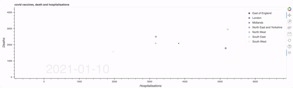
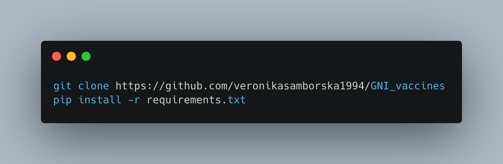

# GNI Fellowship (Financial Times) – Vaccines

> This repository contains the code for the [visualisation](https://vaccinesuk.herokuapp.com/bubble) of the relationship between vaccination rates, hospitalisations, and deaths in the UK during the initial stages of the vaccination programme in early 2021

## Summary

Rarely in human history has a public health campaign received so much international support and mobilisation as the Coronavirus vaccination effort. In this visualisation, I examined the critical early stages of the vaccination programme in the UK. In early 2021, when the vaccine programme was gaining momentum, the relationship between vaccination, hospitalisations, and deaths was a central focus of public interest. 

In early 2021, the number of Covid 19-related deaths and hospital admissions in the UK was steadily falling from mid-January. The key question I wanted to examine is if this is the result of the very successful vaccination programme in the UK.

## Visualisation

This visualisation shows that, at the time, there was little relationship between vaccination of priority groups and the selective decline in deaths and hospitalisations at the time (indeed, this was supported by other findings at the time). This gives rise to the possibility that, at the time, the fall in deaths and hospitalisations might have been due to reduced social interactions during the preceding lockdown.

The visualisation can also be found [here](https://vaccinesuk.herokuapp.com/bubble), using the [Heroku application](https://www.heroku.com/). If the graphic does not load, please refresh the page.

## Installation

